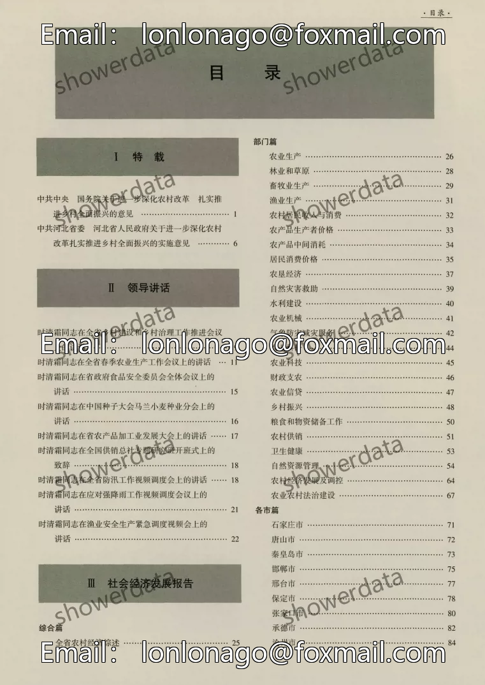
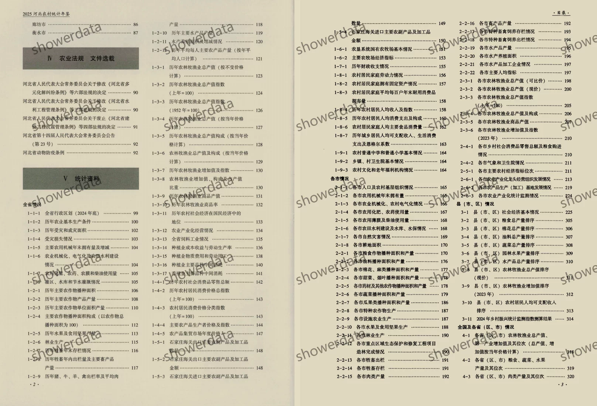
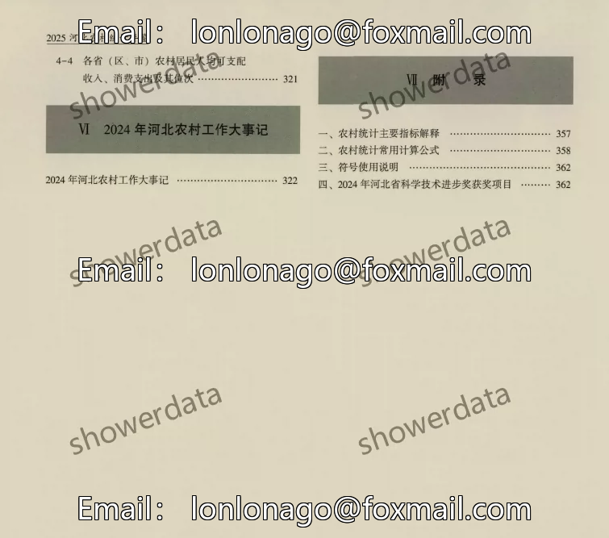
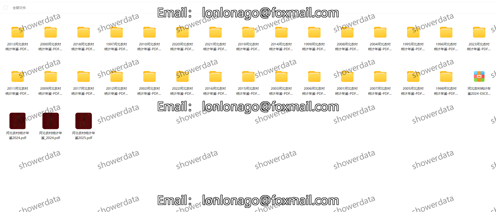

## Body

Hebei Rural Statistical Yearbook (1995-2025)

Data Year: The yearbook covers the years from 1995 to 2025.

01. Data Introduction
"Hebei Rural Statistical Yearbook"

02. Indicator Details
The directory is displayed in the image, please view it on your own and purchase accordingly. If you need help finding specific data, all information is here. After shipment, returns without reason are not supported.
The display directory is for the year 2025, and the statistical methods may vary from year to year. For academic purposes, please be aware of this.

03. Data Content
Formats: Both PDF and Excel are available, with only PDF available for the year 2025.

## Images

Here is a pay link on Stripe ( https://buy.stripe.com/3cs8yP7sY87d0vu9AB ). Please contact me lonlonago@foxmail.com after funding $89, and I will send you a complete data files , thank you!

